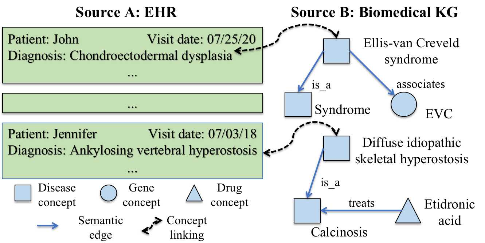
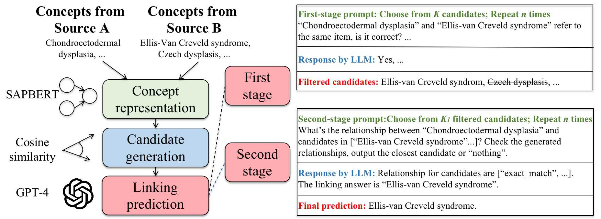

# PromptLink
This repo contains our code for paper "PromptLink: Leveraging Large Language Models for Cross-Source Biomedical Concept Linking".

## Task Description
In this paper, we address the biomedical concept linking task, which aims to link biomedical concepts across sources/systems based on their semantic meanings and biomedical knowledge. It solely relies on concept names, and can thus cover a much broader range of real-world applications. This task differs from existing tasks such as entity linking, entity alignment, and ontology matching, which depend on additional contextual or topological information. A toy example of the biomedical concept linking task is described in the following figure.

    
    
Figure 1: A toy example. Left: concepts in the EHR. Right: concepts in the biomedical KG.

## PromptLink Framework
PromptLink is a novel biomedical concept linking framework that leverages Large Language Models (LLMs). It first employs a pre-trained language model specialized in biomedicine to generate candidate concepts that fit within the LLM context windows. Then, it utilizes an LLM to link concepts through two-stage prompts. The first-stage prompt aims to elicit biomedical prior knowledge from the LLM for the concept linking task, while the second-stage prompt compels the LLM to reflect on its own predictions to further enhance their reliability. The overview of the PromptLink Framework is illustrated in the following figure.

    
    
Figure 2: Overview of our proposed PromptLink framework.

## Package 
**["requirements.txt" file could be used to download the python packages automatically]**

* python==3.8.10

* editdistance==0.6.2

* fire==0.5.0

* numpy==1.19.5

* openai==0.28.1

* pandas==1.3.4

* rank_bm25==0.2.2

* scipy==1.12.0

* simstring_pure==1.0.0

* textdistance==4.6.1

* torch==1.10.0+cu111

* tqdm==4.66.1

* transformers==4.33.3

## Data
We curate two biomedical concept linking benchmark datasets: MIID (MIMIC-III-iBKH-Disease) and CISE (CRADLE-iBKH-Side-Effect), using data from MIMIC-III EHR dataset [MIMIC Link](https://physionet.org/content/mimiciii/1.4/), CRADLE EHR dataset, iBKH KG dataset [iBKH Link](https://github.com/wcm-wanglab/iBKH), and UMLS coding system [UMLS Link](https://www.nlm.nih.gov/research/umls/index.html). Due to the sensitive nature of medical data and privacy considerations, there are restrictions on data sharing. To gain access to these medical datasets, appropriate training and credentials may be required. For further assistance with data access or other related inquiries, please feel free to reach out to our author team.

## Code
Most of the code is stored in three folders: "gen_candidates", "gen_gpt_responses", and "baselines". More details can be found within these folders respectively.

* Folder "gen_candidates": This folder contains the code for PromptLink's concept representation and candidate generation process.

* Folder "gen_gpt_responses": This folder shows how PromptLink leverages the LLM to retrieve the final prediction answer. 

* Folder "baselines": This folder contains the code for running all compared baseline methods, including BM25, Levenshtein Distance, BioBERT, and SAPBERT.

