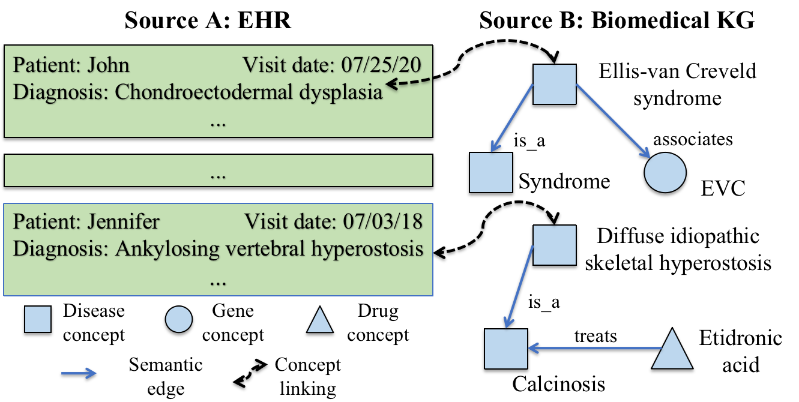
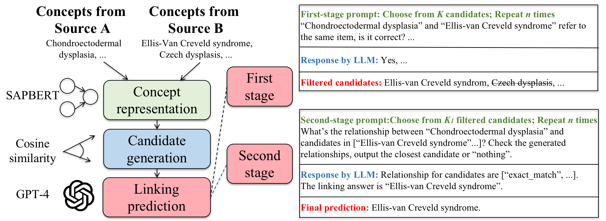

# PromptLink
This repo contains our code for paper "PromptLink: Leveraging Large Language Models for Cross-Source Biomedical Concept Linking".

## Task Description
In this paper, we address the biomedical concept linking task, which aims to link biomedical concepts across sources/systems based on their semantic meanings and biomedical knowledge. It solely relies on concept names, and can thus cover a much broader range of real-world applications. This task differs from existing tasks such as entity linking, entity alignment, and ontology matching, which depend on additional contextual or topological information. A toy example of the biomedical concept linking task is described in the following figure.

    
    
Figure 1: A toy example of biomedical concept linking. Left: concepts in the EHR. Right: concepts in the biomedical KG.

## Model Framework

## Package 
**["requirements.txt" file could be used to download the following packages automatically]**

editdistance==0.6.2

fire==0.5.0

numpy==1.19.5

openai==0.28.1

pandas==1.3.4

rank_bm25==0.2.2

scipy==1.12.0

simstring_pure==1.0.0

textdistance==4.6.1

torch==1.10.0+cu111

tqdm==4.66.1

transformers==4.33.3

